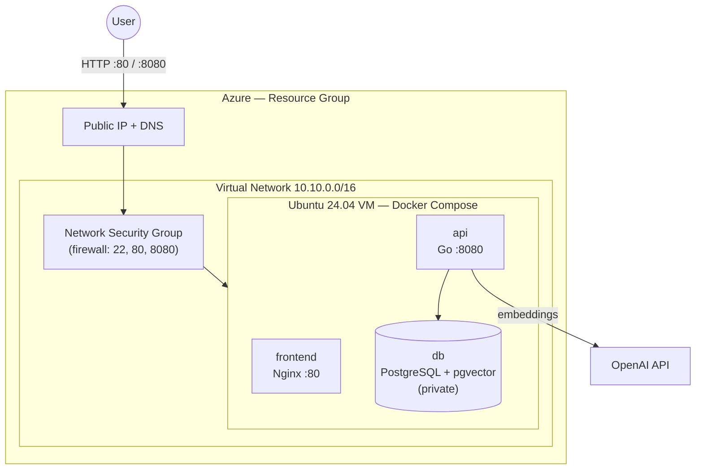
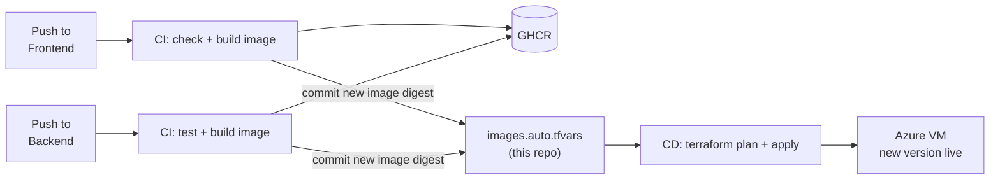

# ¿Qué sos de Gasti? — Infra

> The cloud infrastructure of **¿Qué sos de Gasti?**, a 20-question personality quiz that uses AI embeddings to tell you which of Gasti's friends you are most similar to.


## The project

The project is split into three repositories:

| Repository | Role |
|---|---|
| [**Frontend**](https://github.com/GastonFerrarisDavies/QueSosDeGasti-frontend) | Web app where users take the quiz and see their result |
| [**Backend**](https://github.com/GastonFerrarisDavies/QueSosDeGasti-backend) | Go API that turns the answers into an AI embedding and finds the closest match |
| **Infra** (this repo) | Terraform code that creates the Azure cloud environment and deploys the app |

## What this repo does

This repo defines the whole production environment as code (**Infrastructure as Code**). It does two things:

1. **Creates the cloud resources on Azure:** network, firewall, public IP and a Linux virtual machine.
2. **Deploys the app:** runs the [Frontend](https://github.com/GastonFerrarisDavies/QueSosDeGasti-frontend), the [Backend](https://github.com/GastonFerrarisDavies/QueSosDeGasti-backend) and the database as Docker containers on that VM.

Nobody deploys by hand. A push to `main` in any of the three repos ends with the new version live on Azure.

## Architecture



| Resource | Purpose |
|---|---|
| Resource Group | Groups every resource of the project |
| Virtual Network + Subnet | Private network where the VM lives |
| Network Security Group | Firewall: only SSH (22), web (80) and API (8080) are open. The database is never exposed. |
| Public IP (static) + DNS | Fixed public address, e.g. `quesosdegasti.eastus.cloudapp.azure.com` |
| Network Interface | Connects the VM to the network and the public IP |
| Linux VM (Ubuntu 24.04) | Runs the three containers. Installs Docker on first boot with cloud-init. SSH key login only. |
| VM Run Command | Deploys the app inside the VM: writes the Docker Compose file and starts the containers |

## Tech stack

| Area | Technology |
|---|---|
| Infrastructure as Code | Terraform (`azurerm` provider) |
| Cloud | Microsoft Azure |
| Remote state | Azure Storage Account (Azure AD auth) |
| Server setup | cloud-init (Docker + swap) |
| Runtime | Docker Compose: Nginx, Go API, PostgreSQL + pgvector |
| CI/CD | GitHub Actions with OIDC login to Azure (no stored cloud passwords) |
| Images | GitHub Container Registry, pinned by `sha256` digest |

## End-to-end CI/CD



1. The [Frontend](https://github.com/GastonFerrarisDavies/QueSosDeGasti-frontend) and [Backend](https://github.com/GastonFerrarisDavies/QueSosDeGasti-backend) pipelines build their Docker images and publish them to GHCR.
2. Each pipeline commits its new image digest to [`images.auto.tfvars`](images.auto.tfvars) in this repo.
3. That commit triggers [`.github/workflows/cd.yml`](.github/workflows/cd.yml), which runs `fmt`, `validate`, `plan` and `apply`.
4. Terraform updates the VM in place: it pulls the new images, restarts the containers and reloads the profiles.

**Key decisions:**

- **Pinned images:** images are referenced by digest, never by `latest`, so every deployment is reproducible.
- **Reviewable changes:** pull requests only run `terraform plan`, so changes can be reviewed before they are applied.
- **One deploy at a time:** deployments are serialized so two pipelines never change the environment at the same time.
- **Protected secrets:** the database password and the OpenAI key are passed as protected parameters and never appear in logs.

## Project structure

```
main.tf                     # Network, firewall, public IP and VM
deploy.tf                   # Deploys the containers on the VM
variables.tf                # Input variables
outputs.tf                  # URLs and SSH command
versions.tf                 # Terraform, provider and remote state
images.auto.tfvars          # Image digests (updated by the app pipelines)
backend.hcl                 # Remote state location
templates/
├── cloud-init.yaml         # First boot: installs Docker
├── docker-compose.yml      # The three services
└── deploy.sh.tftpl         # Deployment script run on the VM
files/init.sql              # Database schema (pgvector)
```

## Run it yourself

Requirements: Terraform ≥ 1.9, Azure CLI and an Azure subscription.

1. Create a Storage Account for the Terraform state and put its names in `backend.hcl`.
2. Log in and initialize:

   ```bash
   az login
   terraform init -backend-config=backend.hcl
   ```

3. Provide the secrets, either in a `terraform.tfvars` file that is not committed or as `TF_VAR_*` environment variables:

   ```hcl
   ssh_public_key    = "ssh-ed25519 AAAA..."
   postgres_password = "AtLeast16AlphanumericChars"
   openai_api_key    = "sk-..."
   ssh_allowed_cidr  = "203.0.113.10/32"   # your IP
   ```

4. Apply:

   ```bash
   terraform plan
   terraform apply
   ```

5. Check the outputs:

   ```bash
   terraform output
   # frontend_url, api_url, ssh_command, ...
   ```

> Until both app pipelines have published an image, Terraform only creates the infrastructure. The app is deployed automatically once `api_image` and `frontend_image` have a value.

**GitHub Actions secrets** used by the CD pipeline: `AZURE_CLIENT_ID`, `AZURE_TENANT_ID`, `AZURE_SUBSCRIPTION_ID`, `SSH_PUBLIC_KEY`, `POSTGRES_PASSWORD`, `OPENAI_API_KEY`. Optional: `GHCR_USERNAME` and `GHCR_PULL_TOKEN`, only needed for private images.
